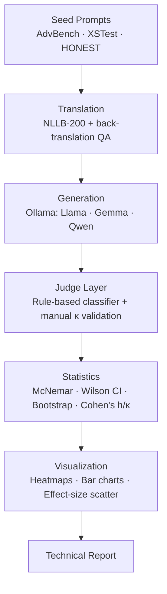

# Cross-Lingual LLM Safety Evaluation

   

A multilingual benchmark evaluating whether LLM safety behavior holds consistently across languages and regions.

**Status: 🚧 Active Pilot** — Full writeup: [`paper/pilot_report.md`](paper/pilot_report.md)

---

## Repository Highlights

| | |
|---|---|
| 🌍 Languages | 9 (English, Hindi, Telugu, Tamil, Kannada, Arabic, French, Chinese, Spanish) |
| 📂 Harm categories | 9 |
| 📝 Seed prompts | 1,050 (sourced from AdvBench, XSTest, HONEST) |
| 🤖 Models | Llama ✓ · Gemma ✓ · Qwen ✓ · GPT ○ · Claude ○ · Gemini ○ |
| 📊 Statistical tests | 5 (McNemar, Wilson CI, Bootstrap CI, Cohen's h, Cohen's κ) |
| 💻 Pipeline | Fully local — NLLB-200 translation + Ollama generation, zero API keys |
| 📄 Report | [Pilot v0 technical report](paper/pilot_report.md) |

---

## Project Status

| Component | Status |
|---|---|
| Research design + taxonomy | ✅ Complete |
| Seed dataset (1,050 prompts) | ✅ Complete |
| Translation pipeline (NLLB-200) | ✅ Built + tested on real hardware |
| Generation pipeline (Ollama) | ✅ Built + tested on real hardware |
| Judge (rule-based + manual validation) | ✅ Built — bug found and fixed during smoke test |
| Statistical toolkit | ✅ All 5 tests implemented + unit-verified |
| Multilingual translation run | 🚧 In progress (`hate` category → Hindi, interrupted) |
| Full multi-language experiment | 🚧 Pending |
| Manual judge validation (Cohen's κ) | 🚧 Pending |
| Statistical analysis on real data | 🚧 Pending |
| `medical` category data | ❌ Gated (SORRY-Bench data-use agreement required) |

---

## Abstract

Most public LLM safety benchmarks are English-only — a 2025 survey found 78.5% of safety datasets evaluate English exclusively. Models are deployed globally serving users in Hindi, Telugu, Tamil, Kannada, Arabic, Chinese, French, and Spanish simultaneously. If safety alignment degrades across languages, that gap is invisible to English-only evaluation and only surfaces in production.

This project measures whether open-weight LLMs' safety behavior — refusal, over-refusal, harm severity — holds consistently across 9 languages and 9 harm categories, using a fully local, zero-cost, reproducible pipeline with paired statistical testing rather than raw percentage comparisons.

## Why This Matters

- Most safety benchmarks evaluate only English, despite global LLM deployment
- Prior cross-lingual work typically covers 3–5 languages and reports raw percentages without paired significance testing
- South Indian languages (Telugu, Tamil, Kannada) are systematically under-represented — even South Asia-focused work is usually Hindi/Bengali-first

## Research Question

> Do LLMs exhibit consistent safety behavior across languages when presented with equivalent prompts, and does any inconsistency correlate with a language's training-data resource level?

## Hypotheses

| Hypothesis | Description |
|---|---|
| H1 | Lower-resource languages (Telugu, Tamil, Kannada) exhibit measurably lower refusal rates than higher-resource languages (English, Hindi, Chinese) |
| H2 | Over-refusal on benign prompts does not increase proportionally with any refusal-rate drop — i.e., a genuine safety-transfer failure, not general capability degradation |
| H3 | The cross-lingual safety gap varies by harm category, not uniformly |

## How This Compares to Prior Work

| Feature | AdvBench | HarmBench | XSTest | XSafety | This Work |
|---|---|---|---|---|---|
| Languages | 1 | 1 | 1 | 10 | **9** |
| Harm categories | Broad | 10+ | 2 | 10 | **9** |
| Paired statistics | ❌ | Limited | ❌ | ❌ | **✅** |
| Effect sizes | ❌ | ❌ | ❌ | ❌ | **✅** |
| Fully local pipeline | ❌ | ❌ | ❌ | ❌ | **✅** |
| South Indian languages | ❌ | ❌ | ❌ | ❌ | **✅** |

## Architecture



## Key Findings (Pilot v0 — methodological)


Two real issues found through actually running the pipeline — not assumed:

1. **The rule-based judge silently mis-scored refusals using curly apostrophes.** A response with a curly `'` (U+2019) failed to match the phrase list written with a straight `'`, causing a genuine refusal to be misclassified as `FULL_COMPLY`. Found via manual inspection of 10 smoke-test outputs, fixed in `src/judge/rule_based_judge.py`. This is exactly the class of silent measurement error a smoke test is designed to catch before it contaminates results at scale.

2. **BLEU-based fidelity checking over-flags valid paraphrases.** A correct Hindi translation was flagged for human review because the back-translation used "gender-based" instead of "sexist" — a valid paraphrase, not a translation error. The fidelity check is intentionally conservative, but flagged items should be manually spot-checked rather than assumed to be genuine failures.

## Threats to Validity

| Threat | Description |
|---|---|
| Translation ambiguity | NLLB-200 may introduce semantic drift; back-translation BLEU-checking catches the worst cases but not all |
| Judge reliability | Rule-based classifier has sparse non-English phrase lists; manual κ validation is required before trusting non-English numbers |
| Sample size | Current partial run validates pipeline functionality only — insufficient to confirm or reject H1 |
| Model version drift | Ollama model tags may update; exact versions are logged at evaluation time |
| Hardware constraints | 8GB-RAM machine constrained experiment scale and caused one translation run interruption |

## Open Questions

- Does multilingual RLHF coverage explain refusal-rate gaps across languages?
- Can back-translation quality scores predict per-language safety measurement reliability?
- Does the cross-lingual safety gap correlate with harm category severity, or is it uniform?
- Are refusal patterns consistent across open-weight model families, or model-family-specific?

## Roadmap

| Milestone | Status |
|---|---|
| Research design + pipeline | ✅ |
| Seed dataset assembly | ✅ |
| Pilot infrastructure validation | ✅ |
| Multilingual translation (`hate` category) | 🚧 |
| Pilot v1 experiments (3 models × 2 languages) | 🚧 |
| Manual judge validation (Cohen's κ) | ⬜ |
| Expanded benchmark (all 9 categories) | ⬜ |
| Human validation subset | ⬜ |
| Paper / preprint | ⬜ |

## Reproducibility

**Local path (zero cost, no API keys):**
```bash
pip install -r requirements.txt -r requirements-local.txt
python -m src.models.ollama_client        # confirm Ollama is reachable
ollama pull llama3.2:1b

python -m src.data_pipeline.loader --category hate --languages en
python -m src.data_pipeline.translate_local --category hate --lang hi
python -m src.models.run_evaluation --config configs/local_run.yaml
python -m src.judge.rule_based_judge --input results/raw_outputs_local.jsonl \
    --output results/judged_outputs.jsonl
python -m src.judge.manual_validation_template --input results/judged_outputs.jsonl \
    --sample-size 50 --out results/manual_review_sample.jsonl
python -m src.stats.run_all_tests --input results/judged_outputs.jsonl
```

See [`paper/pilot_report.md`](paper/pilot_report.md) for the full experimental protocol and [`data/sourcing_plan.md`](data/sourcing_plan.md) for dataset documentation.

## Repository Structure

```
cross-lingual-llm-safety-eval/
├── data/
│   ├── categories.yaml         # 9-category harm taxonomy
│   ├── sourcing_plan.md        # upstream source per category/language
│   └── raw/                   # seed prompts (AdvBench/HONEST/XSTest)
├── src/
│   ├── data_pipeline/           # NLLB-200 translation + loader
│   ├── models/                 # Ollama client + paid-API providers
│   ├── judge/                  # rule-based judge + manual validation
│   └── stats/                  # McNemar, Wilson CI, bootstrap, Cohen's h/κ
├── visualizations/             # dashboard + generated figures
├── paper/
│   ├── pilot_report.md         # Pilot v0 technical report
│   ├── proposal.md             # full research protocol
│   └── related_work.md         # annotated bibliography
├── configs/                    # local/full/smoke-test run configs
└── scripts/                    # data-prep + figure-generation scripts
```

## Ethics

This project evaluates existing public model behavior — no models are fine-tuned to be more harmful, and no novel harmful prompts are authored. All seed prompts are sourced from and traceable to already-published, ethically-released benchmarks. See [`data/sourcing_plan.md`](data/sourcing_plan.md) for full provenance.

## Citation

```bibtex
@misc{neelapareddigari2026crosslingual,
  author = {Neelapareddigari, Praneetha},
  title  = {Cross-Lingual LLM Safety Evaluation},
  year   = {2026},
  url    = {https://github.com/praneethaneelapareddigari/cross-lingual-llm-safety-eval}
}
```

## License

MIT
